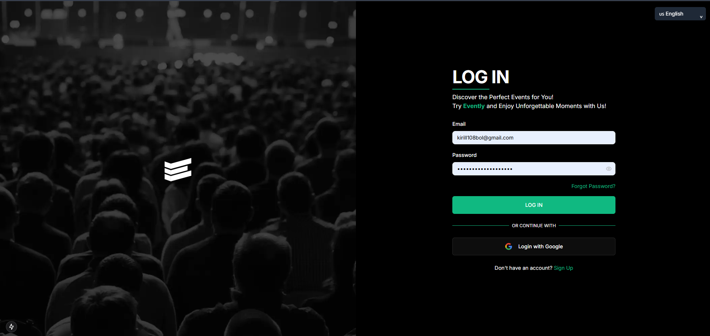
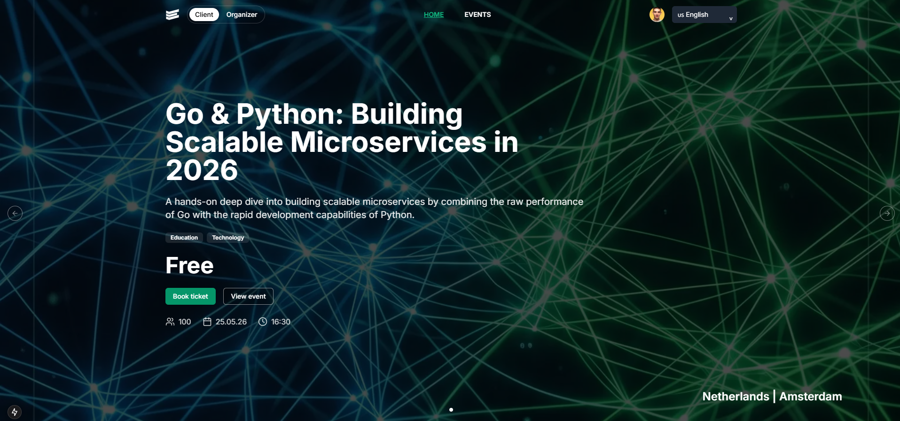
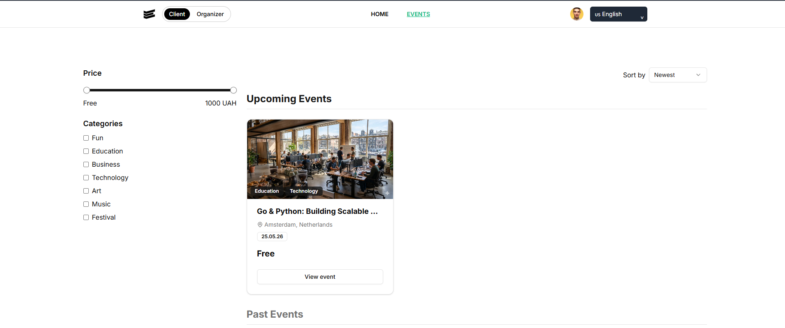
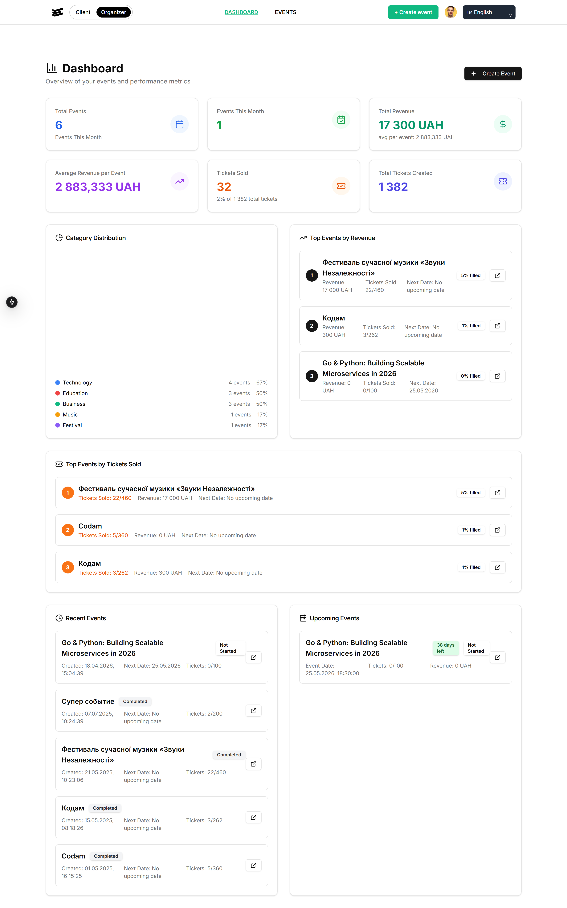
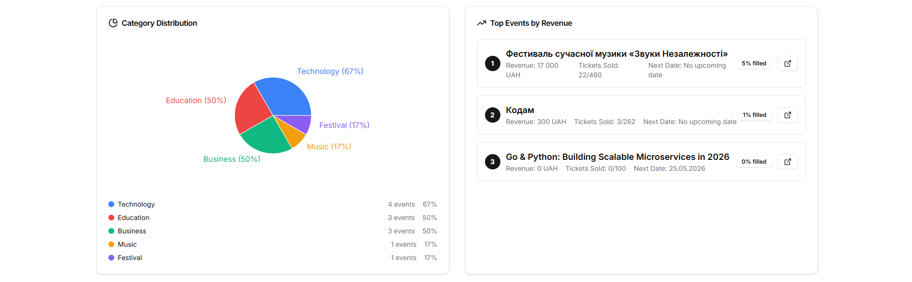
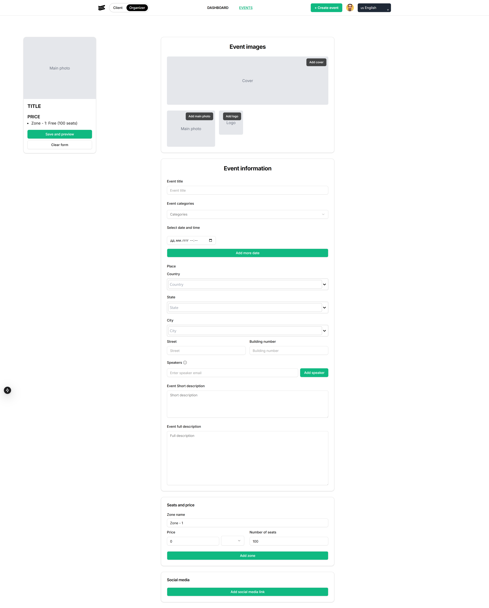
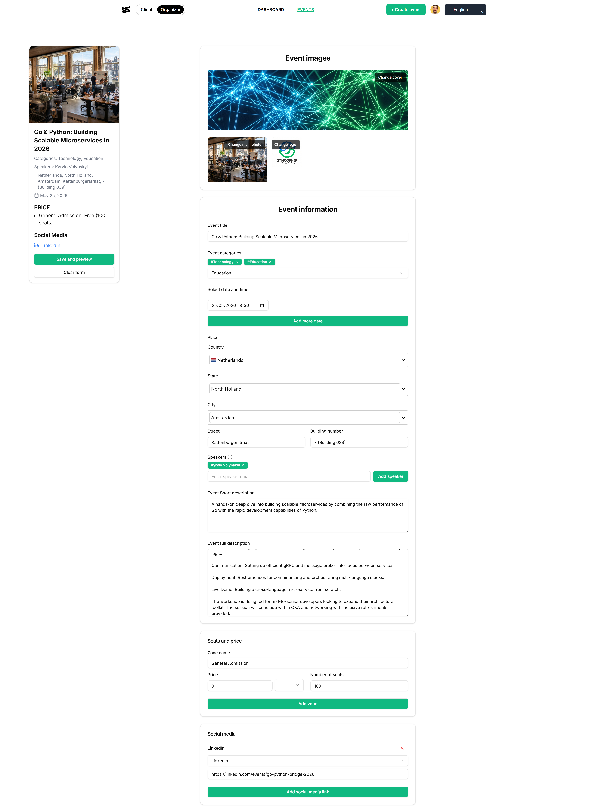

# Eventy

**Eventy** is a modern, full-stack web platform designed for seamless event organization and discovery. It provides a comprehensive solution for both event organizers and participants, featuring a polished UI and robust management tools.

Backend repository: [Eventy Backend](https://github.com/Volynskyi-Kirill/Eventy-Backend).

## 🚀 Key Features

- **Dual-Role System**: Users can switch between **Client** and **Organizer** roles within a single account.
- **Secure Authentication**: Robust security using JWT-based sessions and Google OAuth 2.0 integration.
- **Advanced Discovery**: Real-time event filtering by category, price range, and location with various sorting options.
- **Organizer Tools**:
    - **Dashboard**: Track ticket sales, revenue, and audience statistics.
    - **Event Creation**: Multi-step forms for event details, seat zones, pricing, and speaker management with a live preview.
- **Participant Experience**: Detailed event presentations (including descriptions, schedules, and Google Maps integration) and a streamlined ticket booking process.
- **Localization**: Full multi-language support for English and Ukrainian using `next-intl`.

## 🛠 Tech Stack

- **Frontend**: Next.js 15 (App Router), TypeScript, Tailwind CSS, ShadCN UI.
- **State Management**: Zustand.
- **Backend**: NestJS, Prisma ORM, PostgreSQL.

## 📸 Interface Preview

### Authentication

Secure access via traditional credentials or Google social login.

### Home page

View the most relevant event

### Event discovery

Browse a wide variety of events with powerful filtering tools.

### Event Details

Rich event presentation with descriptions and integrated maps.

### Organizer Dashboard

Monitor your success and manage upcoming sessions from a central hub.

_category distribution close view_

### Creating Events

Structured multi-step creation process with real-time feedback.

**Empty form**

**Filled form**

